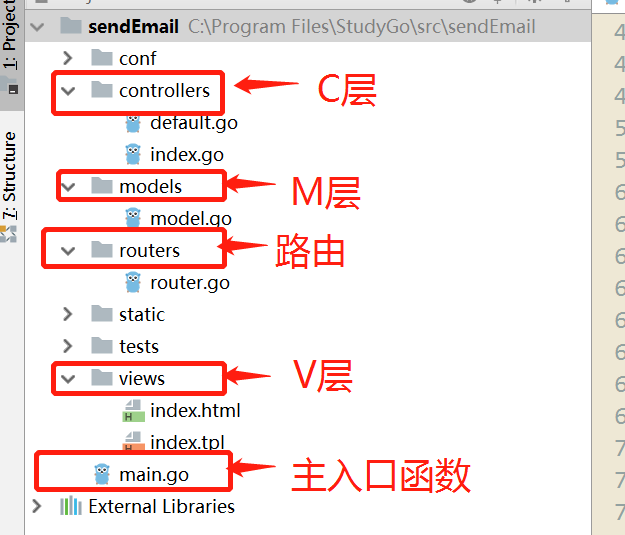
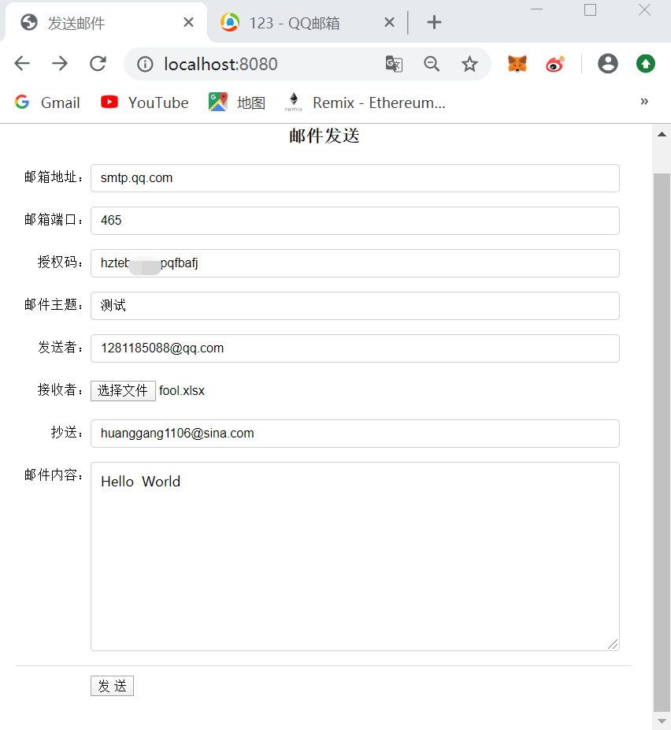
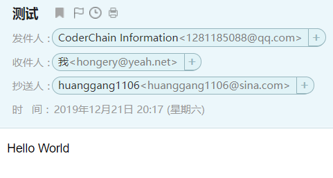
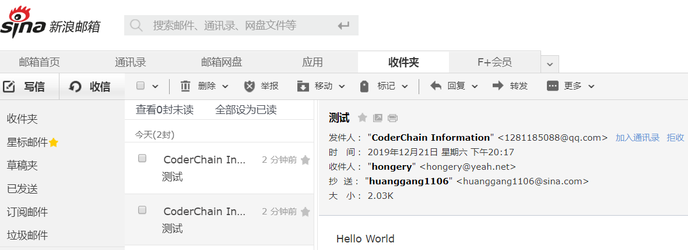

## 定时发送邮件

### 1.环境准备

|  工具   |               版本                |
| :-----: | :-------------------------------: |
|   go    |               1.9.2               |
| web框架 | [beego](github.com/astaxie/beego) |

#### 安装依赖包

```go
go get github.com/go-gomail/gomail  //email包
go get github.com/tealeg/xlsx     //读取后缀.xlsx文件
```

#### 安装web框架

下载安装beego和bee（注意：beego和bee是两个概念，beego是框架，bee是命令工具）
1.下载和安装beego，下载安装成功后我们会在 GOPATH 的 src/github.com 中看到 astaxie 文件夹，beego安装成功。

```go
go get -u github.com/astaxie/beego
```

2.安装bee工具，下载安装成功后我们会在 GOPATH 的 src/github.com 中看到 beego 文件夹，bee安装成功。

```go
go get -u github.com/beego/bee
```

[安装教程]( https://blog.csdn.net/qq_40876727/article/details/83624135 )

### 2.目录结构



### 3.功能实现

####   参数配置

```go
type EmailParam struct {
    // ServerHost type EmailParam struct ，如腾讯qq邮箱为smtp.qq.com
	ServerHost string
	// ServerPort 邮箱服务器端口，如腾讯qq邮箱为465
	ServerPort int
	// FromEmail　发件人邮箱地址
	FromEmail string
	// FromPasswd 发件人邮箱授权码（注意，这里是明文形式），TODO：如果设置成密文？
	FromPasswd string
	// Toers 接收者邮件，如有多个，则以英文逗号(“,”)隔开，不能为空
	Toers string
	// CCers 抄送者邮件，如有多个，则以英文逗号(“,”)隔开，可以为空
	CCers string
}
//填写格式如下
	serverHost := "smtp.qq.com"		//邮箱服务器端口 
	serverPort := 465				//邮箱服务器端口
	fromEmail := "12***88@qq.com"	// 发送者邮箱
	fromPasswd := "hz****fj"		// 授权码
	myToers :=""					//  接收者邮箱   通过读取文件获取
	myCCers := "hon**@yeah.net" 	//抄送者邮箱		通过页面获取
```

#### 文件上传（接收者邮箱）

```go
		//文件上传
		f, h, err := c.GetFile("uploadname")
		//defer f.Close()
		//1.限定格式 .xlsx
		fileext := path.Ext(h.Filename) //取出后缀
		beego.Info(fileext)
		if fileext != ".xlsx" {
			beego.Info("上传文件格式错误")
			return
		}
		//2.限制大小
		/*if h.Size > 1000000000{
		beego.Info("上传文件过大")
		return
		}*/
		//3.对文件重新命名，防止重复
		filename := time.Now().Format("2006-01-02") + fileext //6-1-2 3:4:5
		if err != nil {
			beego.Info("上传文件失败")
			/*fmt.Println("getfile err",err)*/
		} else {
			//保存文件到 /static/***.xlsx
			c.SaveToFile("uploadname", "./static/"+filename)
		}
```

#### 读取xlsx文件的数据

```go
func (c *MainController)TimeSettle(filename,subject,body string,myEmail *models.EmailParam) {
			//读取文件中的邮箱
			excelFileName := "./static/"+filename //excel文件路径
			xlFile, err := xlsx.OpenFile(excelFileName)
			if err != nil {
				log.Panic(err)
			}
			//读取xlsx文件
			for _, sheet := range xlFile.Sheets {
				for _, row := range sheet.Rows {
					for _, cell := range row.Cells {
						myEmail.Toers=myEmail.Toers+cell.String()
					}
				}
			}
			c.InitEmail(subject, body,myEmail)
			c.SendEmail(myEmail)
}
```

#### 初始化

```go
//初始化数据
func InitEmail(subject,body string,ep *models.EmailParam) {
	ccers :=[]string{}
	m = gomail.NewMessage()
	//抄送列表
	if len(ep.CCers) != 0 {
		for _, tmp := range strings.Split(ep.CCers, ",") {
			ccers = append(ccers, strings.TrimSpace(tmp))
		}
		m.SetHeader("Cc", ccers...)
	}
	// 发件人
	// 第三个参数为发件人别名，如"CoderChain"，可以为空（此时则为邮箱名称）
	m.SetAddressHeader("From", ep.FromEmail, "CoderChain Information")
	m.SetHeader("Subject", subject) // 主题
	m.SetBody("text/html", body)// 正文 body支持html格式字符串
}
```

#### 发送邮件

```go
// SendEmail
func SendEmail(ep *models.EmailParam) {
	d := gomail.NewPlainDialer(ep.ServerHost, ep.ServerPort, ep.FromEmail, ep.FromPasswd)
	// 发送
	if len(ep.Toers) != 0 {
		for _, tmp := range strings.Split(ep.Toers, ",") {
			m.SetHeader("To", strings.TrimSpace(tmp))
			err := d.DialAndSend(m)
			if err != nil {
				s :=fmt.Sprint(err)
				c.Ctx.WriteString(s)
			}
		}
	}else{
		return
	}
}
```

### 4.定时发送

如果需要定时发送功能可以将上面TimeSettle函数换成下面这个

```go
func (c *MainController)TimeSettle(filename,subject,body string,myEmail *EmailParam) {
	d := time.Duration(time.Minute)
    t := time.NewTicker(d)
    defer t.Stop()
    for {
        currentTime := time.Now()
        //Hours/Week没天几点或每周几  下面是每个小时中的第21分钟方便测试
        if currentTime.Minute() == 21 { 
            //读取文件中的邮箱
            excelFileName :=  "./static/"+filename  //excel文件路径
            xlFile, err := xlsx.OpenFile(excelFileName)
            if err != nil {
                log.Panic(err)
            }
            for _, sheet := range xlFile.Sheets {
                for _, row := range sheet.Rows {
                    for _, cell := range row.Cells {
                        myEmail.Toers=myEmail.Toers+cell.String()
                    }
                }
            }
            InitEmail(subject, body,myEmail)
            SendEmail(myEmail)
            time.Sleep(time.Minute)  //需要修改Hours/Weeks
        }
        <-t.C
    }
}
```

### 5.功能展示

#### 发送邮件表单

（除抄送输入框可以为空，其他输入框必须填上，抄送可以填多个邮箱要使用逗号隔开）



##### 改进：

​		为了减少信息的填写，可以将邮箱地址、端口，授权码，发送者邮箱写死

#### 接收者显示



#### 抄送者邮箱



